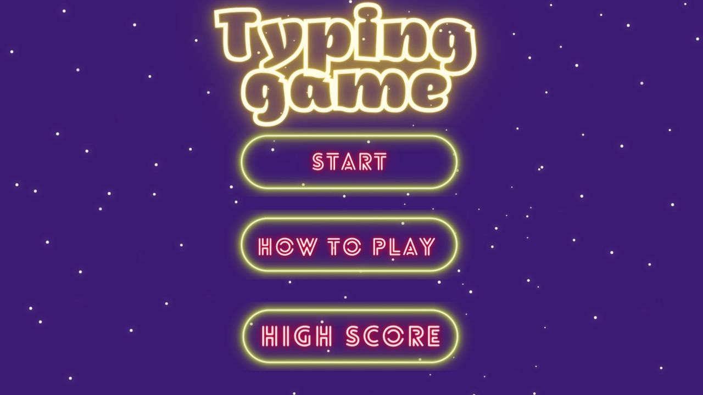
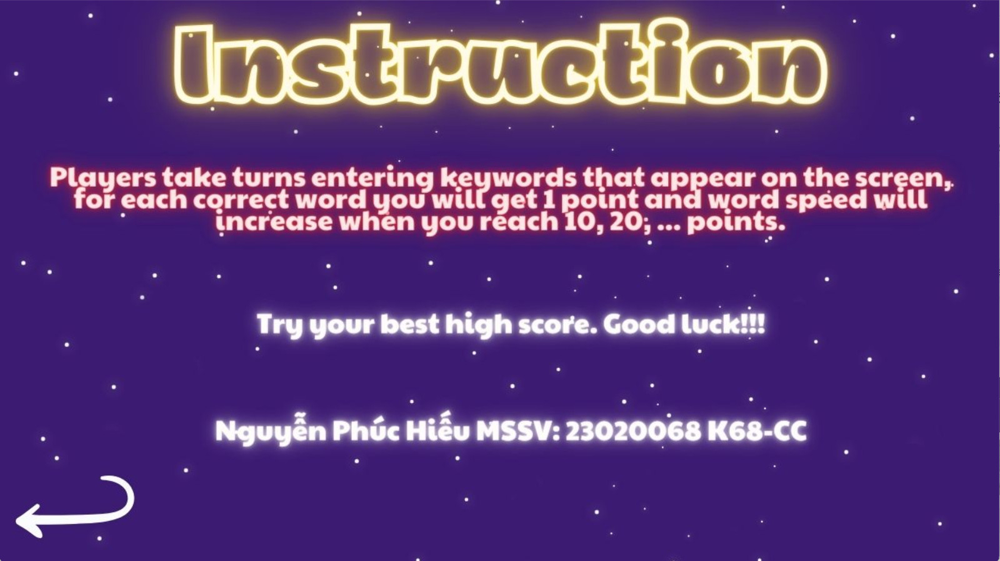
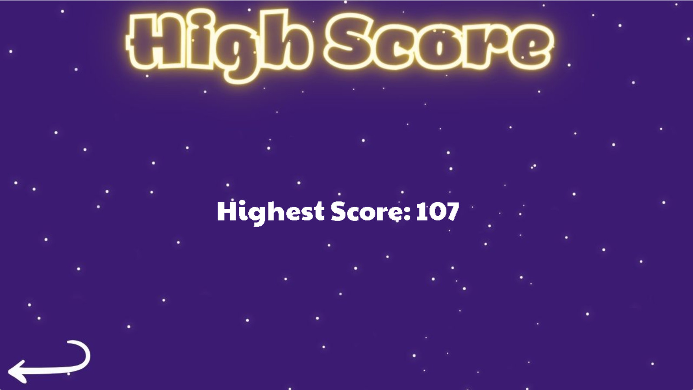

# Typing Words Game

* [Mã nguồn và thử nghiệm game](https://drive.google.com/drive/u/1/folders/1fFg55OxbwQbiW3doYJgjYl-Y0myOc03Q)
## Giới thiệu game

Typing Words Game là một game thuộc thể loại trò chơi giáo dục hoặc trò chơi giải đố. Trong Typing Words Game, người chơi phải gõ nhanh và chính xác các từ hoặc cụm từ để tiêu diệt các từ đó đang tiến lại. Trò chơi này thường được sử dụng để rèn luyện và nâng cao kỹ năng gõ phím của người chơi, đồng thời cũng giúp cải thiện tốc độ đọc và phản xạ của họ.

## 0. Cách tải game

### a. Cách 1: Không bao gồm code

Tải game (được nén thành .zip) tại link sau: [Typing Words Game](https://drive.google.com/drive/u/0/folders/17qjE_YORiGbm53hWyLdaYk3PtC2GrZ9b)
Cách này tiết kiệm bộ nhớ và thời gian tải đi rất nhiều (khoảng 33MB).

Giải nén game vào một thư mục và bật TypingGameSDL.exe lên và chơi.

### b. Cách 2: Bao gồm code và có thể biên dịch

Bước 1:  Chọn Code -> Download Zip (Khoảng 35MB)

## 1. Bắt đầu game

Bạn sẽ thấy một màn hình menu chính gồm 3 nút.
* Bấm "START" để bắt đầu trò chơi.
 
* Bấm "HOW TO PLAY" để xem hướng dẫn cụ thể.

* Bấm "HIGH SCORE" để xem điểm chơi cao nhất từ đó tạo động lực cho người chơi vượt qua.

## 2. Các thành phần trong game 

Ở thanh BAR sẽ hiện từ bạn đang gõ, score, và HP.

Bạn sẽ thấy các từ tiếng Anh xuất hiện trên màn hình. Phía góc trái là nút "PAUSE".

## 3. Cách chơi
Hãy dùng kĩ năng gõ phím nhanh và chính xác của mình để loại bỏ các chữ cái.

Sau khi từ được bôi đỏ hết nhấn "SPACE" hoặc "ENTER" để loại bỏ và chuyển sang từ tiếp theo.
Bạn có 3 HP nếu bạn để từ của mình chạy sang qua hết màn hình, HP sẽ giảm theo số lượng từ. Khi HP bằng 0 màn hình GAME OVER sẽ hiển thị.

## Về đồ họa của game

Mình edit trên Canva.

* [Canva - trình thiết kế Website](https://www.canva.com/)

* Font chữ FSEX302.tff, PaytoneOne.tff.

## Về âm thanh của game

* [Nhạc nền](https://nofatenetmusic.bandcamp.com/album/the-phoboslab-works)
* [Âm thanh hiệu ứng](https://pixabay.com/vi/music/)

## Về source code game

* Mình đã push lên [github](https://github.com/HieuNguyen1905/TypingGame.git)
* Nguồn tham khảo [SDL2](https://wiki.libsdl.org/)
* Nguồn tham khảo [cài SDL2](https://lazyfoo.net/tutorials/SDL)

## Về sự hỗ trợ

Em xin chân thành cảm ơn sự hỗ trợ nhiệt tình từ:

* Thầy TS. Lê Đức Trọng
* Thầy CN. Trần Trường Thuỷ
* Mentor Nguyễn Tân Nguyên

## Kết luận

Qua bài tập lớn này em thấy:

* Đã học được cách sử dụng github
* Đã biết sử dụng SDL2 để sử dụng đồ hoạ
* Đã biết chia nhỏ code
* Học thêm được nhiều kĩ năng lập trình

